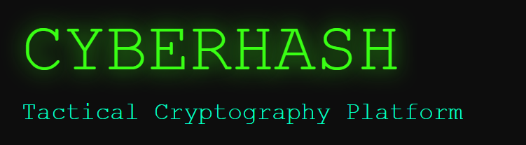

<p align="center">
  
</p>

<h1 align="center">🟩 CyberHash</h1>

<p align="center">
  Tactical Cryptography Platform
</p>

<p align="center">
  🚀 Simulate Attacks • Analyze Security • Gain Intelligence
</p>

<p align="center">
  
  
  
  
  
</p>

---

## 🌍 Live Demo

👉 https://your-live-url.vercel.app

---

## 🖥️ Preview

<p align="center">
  
  
</p>

---

## ⚡ Core Features

### 🔍 Smart Attack Simulator

Automatically detects hash types (MD5, SHA-256, bcrypt, Argon2, etc.) and simulates real-world dictionary attacks.

### 🔐 Multi-Hash Generator

Generate hashes across:

* MD5, SHA-2, SHA-3
* BLAKE2 / BLAKE3
* bcrypt, Argon2id, scrypt

### 📊 Performance Benchmarking

Visualize algorithm performance and understand the tradeoff between speed and security.

### 🧪 Argon2 Tuning Lab

Experiment with:

* Time Cost
* Memory Cost
* Parallelism

### 🛠️ Custom Wordlists

Upload `.txt` files or manually input custom attack dictionaries.

---

## 🧠 How It Works

```id="c1x8zg"
User Input (Password / Hash)
            ↓
Frontend (React UI)
            ↓
API Request (Flask Backend)
            ↓
Hash Engine
  ├── Hash Generator (MD5, SHA, bcrypt, Argon2)
  ├── Detection Engine (Identify Hash Type)
  └── Attack Simulator (Dictionary Attack)
            ↓
Processing & Analysis
            ↓
Results Returned to UI
            ↓
Visualization (Charts + Terminal Output)
```

---

## 🎯 Why CyberHash?

* Understand how weak passwords get cracked
* Learn modern password hashing techniques
* Simulate real-world attack scenarios safely
* Compare security vs performance tradeoffs

---

## 🏗️ Architecture

Frontend (React + Tailwind)
↓
Flask API (Python)
↓
Hash Engine + Attack Simulator

---

## 🛠️ Tech Stack

### Frontend

* React (Vite)
* Tailwind CSS
* Framer Motion
* Recharts

### Backend

* Flask (Python)
* argon2-cffi
* bcrypt
* blake3
* hashlib

---

## 🚀 Getting Started

### 1. Clone Repository

```bash id="t0yr3w"
git clone https://github.com/adityasing9/CyberHash.git
cd CyberHash
```

### 2. Backend Setup

```bash id="e6gxw9"
cd backend
python -m venv venv
venv\Scripts\activate
pip install -r requirements.txt
python app.py
```

### 3. Frontend Setup

```bash id="k3s2dl"
cd ../frontend
npm install
npm run dev
```

---

## 🧪 Example

```id="b7qz9n"
Input: password123  
Hash: ef92b778...  
Result: Cracked in 0.3s using dictionary attack  
```

---

## 🛡️ Security Disclaimer

This project is intended for **educational and authorized security testing only**.
Do not use against systems without proper permission.

---

## 👨‍💻 Author

Aditya Singh
🔗 https://github.com/adityasing9

---

⭐ If you found this project useful, consider starring the repository!
